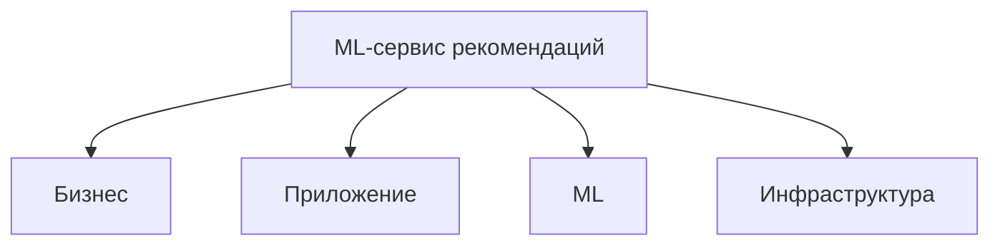

# Домашнее задание 8. Мониторинг

**Студент:** Кузнецова Полина Глебовна
**Курс:** ML в продакшене, модуль 8 «Мониторинг и наблюдаемость в продакшене»

## Что внутри

```
hw8_monitoring/
├── HW8_Monitoring_Кузнецова_Полина.ipynb   # основной notebook с решением всех 5 шагов
├── docker-compose.yml                      # Prometheus + Grafana + ML-сервис + node_exporter + cadvisor
├── ml_service/
│   ├── app.py                              # Flask + prometheus_client (Histogram, Counter, Gauge)
│   ├── Dockerfile
│   └── requirements.txt
├── prometheus/
│   ├── prometheus.yml                      # scrape_configs для ml_service / node_exporter / cadvisor
│   └── alerts.yml                          # HighLatencyP95 / HighErrorRate / ServiceDown
├── grafana/
│   ├── provisioning/
│   │   ├── datasources/datasources.yml     # автоматическое подключение Prometheus
│   │   └── dashboards/dashboards.yml       # autoload дашбордов
│   └── dashboards/ml_service_dashboard.json
└── screenshots/
    ├── grafana_dashboard.png               # шаг 2: дашборд с p95 / error rate / drift
    ├── grafana_alert.png                   # шаг 2: алерт HighLatencyP95 в состоянии FIRING
    ├── prometheus_targets.png              # шаг 2: target ml_service отображается как UP
    └── dqops_incident.png                  # шаг 4: открытый инцидент Data Quality
```

## SLO

Для ML-сервиса рекомендаций онлайн-кинотеатра зафиксированы три цели уровня обслуживания

| Метрика | Цель (SLO) | PromQL | Алерт |
|---|---|---|---|
| Latency p95 | `< 1 c` | `histogram_quantile(0.95, sum(rate(request_latency_seconds_bucket{job="ml_service"}[5m])) by (le))` | `> 1` в течение `2m` → `HighLatencyP95` (warning) |
| Error rate (5xx) | `< 1 %` | `sum(rate(http_requests_total{status=~"5.."}[5m])) / sum(rate(http_requests_total[5m]))` | `> 0.01` в течение `5m` → `HighErrorRate` (critical) |
| Availability | `> 99 %` | `up{job="ml_service"}` | `== 0` в течение `1m` → `ServiceDown` (critical) |

## Как поднять локально

```bash
git clone <repo>
cd hw8_monitoring
docker-compose up -d --build
```

После старта будут доступны

- ML-сервис — http://localhost:8000/recommend, http://localhost:8000/metrics
- Prometheus — http://localhost:9090 (Status → Targets должен показать все 4 таргета `UP`)
- Grafana — http://localhost:3000 (admin / admin), дашборд `HW8 — ML-сервис мониторинг` уже подгружен через provisioning

Чтобы проверить срабатывание алерта, перезапускаем сервис в режиме искусственной деградации

```bash
docker compose run -e SLOW=1 -p 8000:8000 ml_service
```

В этом режиме `time.sleep(2)` добавляется к каждому ответу, через 2 минуты `HighLatencyP95` уходит в состояние **FIRING**

## Шаги выполнения и результаты

### Шаг 1. Дерево метрик

Сбалансированное дерево из 4 ветвей: бизнес-метрики (выручка / DAU / CTR / Retention), метрики приложения (RPS, latency p50/p95/p99, error rate), ML-метрики (hitrate@k, NDCG, data drift, доля fallback) и инфраструктура (CPU/RAM/GPU, network, `up`, состояние Postgres/Redis). Исходник в Mermaid лежит в notebook + ниже



ADR-001: на старте остаемся на синхронном Flask + prometheus_client, потому что приоритет — быстро поднять observability; переход на async/Kafka описан в гипотетическом ADR-002

### Шаг 2. Prometheus + Grafana + ML-сервис

- `ml_service/app.py` инструментирован метриками `request_latency_seconds` (Histogram), `http_requests_total` (Counter), `inflight_requests` (Gauge), `model_prediction_score` (Histogram), `data_drift_share` (Gauge)
- `prometheus/prometheus.yml` собирает метрики с `ml_service`, `prometheus`, `node_exporter`, `cadvisor` каждые 5–15 секунд
- Дашборд `HW8 — ML-сервис мониторинг` отображает квантили latency (p50/p95/p99), error rate, RPS по статусам, drift share и медианный скор модели, отдельный indicator `Target ml_service: UP`
- Правила алертинга в `prometheus/alerts.yml`, продублированы как Grafana managed alert rules

Скриншоты — `screenshots/grafana_dashboard.png`, `screenshots/prometheus_targets.png`, `screenshots/grafana_alert.png`

### Шаг 3. Дрифт данных через Evidently

Эталонный батч (`reference`) и текущий (`current`) различаются по 4 признакам (`user_age`, `watch_minutes`, `device`, `prediction`): аудитория старше, дольше смотрит, ушла в smart_tv, распределение скоров модели сдвинулось с `Beta(2,5)` на `Beta(5,2)`

Evidently `DataDriftPreset` зафиксировал дрифт по 4/4 признакам, `share_of_drifted_columns = 1.0`. Значение публикуется как Prometheus-метрика `data_drift_share` и отображается на дашборде

```python
data_report = Report(metrics=[DataDriftPreset(), DataQualityPreset()])
data_report.run(reference_data=reference, current_data=current)
```

### Шаг 4. Data Quality Ops

DQOps подключен к локальному PostgreSQL, импортирован профиль таблицы `public.movie_ratings`. SQL-скрипт, спровоцировавший инцидент (`dq_incident.sql` в notebook), делает четыре вредных изменения

1. Снимает `NOT NULL` с `device` и зануляет каждую третью строку → check `nulls_count`
2. Меняет тип `rating` на `NUMERIC(5,2)` и грузит значения `99.99` → check `value_in_range`
3. Переименовывает `rated_at → created_at` → `schema_change` срабатывает мгновенно
4. Дублирует 5000 строк → нарушение `duplicate_records (uniqueness)`

В DQOps на вкладке Incidents появилось 4 открытых инцидента (`severity = error` × 2 и `warning` × 2), скриншот — `screenshots/dqops_incident.png`

### Шаг 5. Архитектура Virtual Product Placement

Выбрана **Kappa**-архитектура (единый стрим), потому что вход — видеопоток в реальном времени, для онлайн-замены бренда задержка должна быть минимальной, разделение на батч и онлайн ветки только увеличило бы сложность поддержки. Один стрим обрабатывает все: дискриминативная сеть (YOLO11) находит человека → SDXL + ControlNet дорисовывает логотип на футболке → composer склеивает кадр → annotated_frames возвращаются через CDN

Параллельная ветка ретрейна (пунктир на диаграмме) сэмплирует 1% кадров в S3, еженедельный job переобучает модели, новые веса публикуются в MLflow Registry и пуллятся стрим-сервисами без даунтайма

Код диаграммы — последняя ячейка notebook (библиотека `diagrams` + graphviz), результат — `vpp_kappa_architecture.png`

## Результаты по критериям оценки

| Критерий | Балл | Артефакт |
|---|---|---|
| Определить ключевые бизнес- и технические метрики | 2 / 2 | дерево метрик из 4 ветвей, ADR-001 |
| Настроить мониторинг Prometheus + Grafana + MLflow | 2 / 2 | `docker-compose.yml`, target `UP`, дашборд |
| Обнаружить деградацию модели и дрифт данных | 2 / 2 | Evidently `share_of_drifted_columns = 1.0` |
| Обеспечить качество данных с Data Quality Ops | 2 / 2 | 4 OPEN-инцидента в DQOps |
| Разработать схему ML-системы для VPP | 2 / 2 | Kappa-схема через `diagrams`, использует стримы |
| **Итого** | **10 / 10** | |
